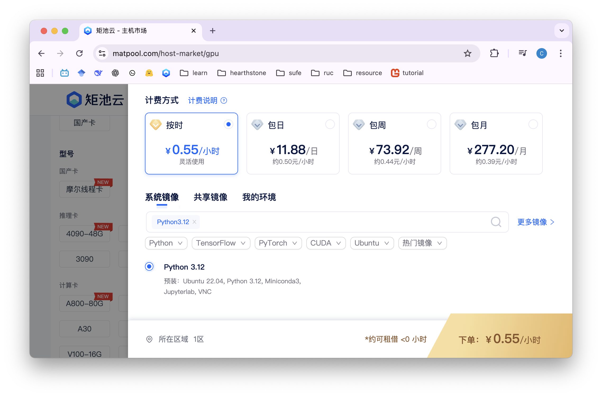
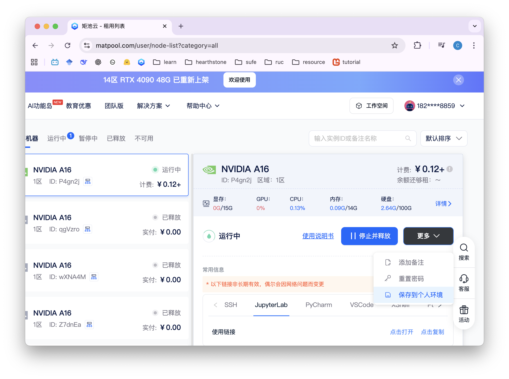
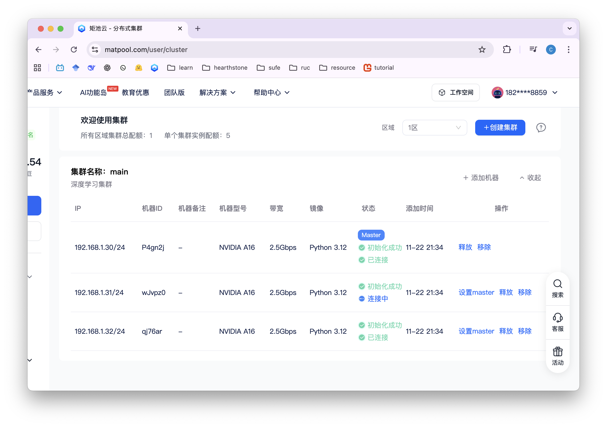
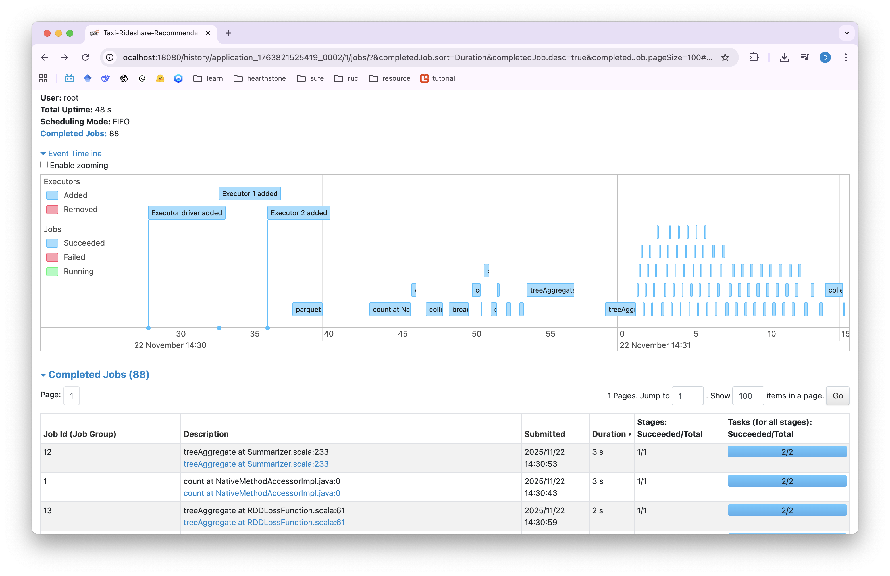
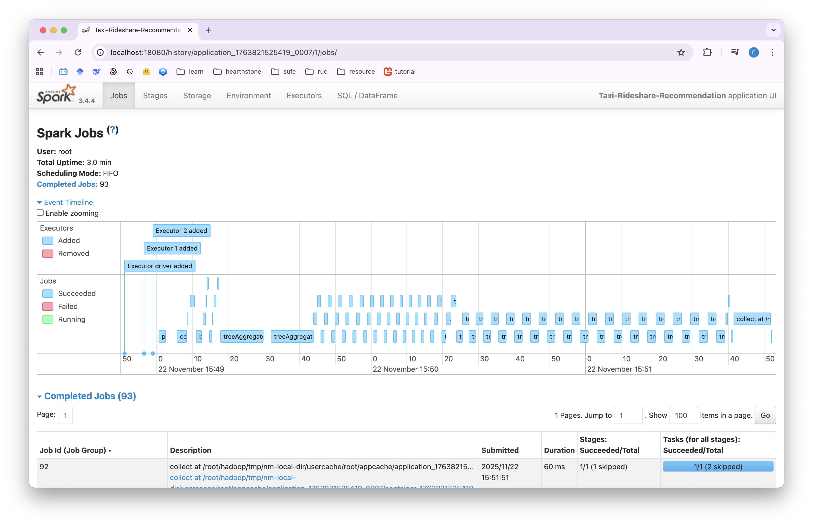
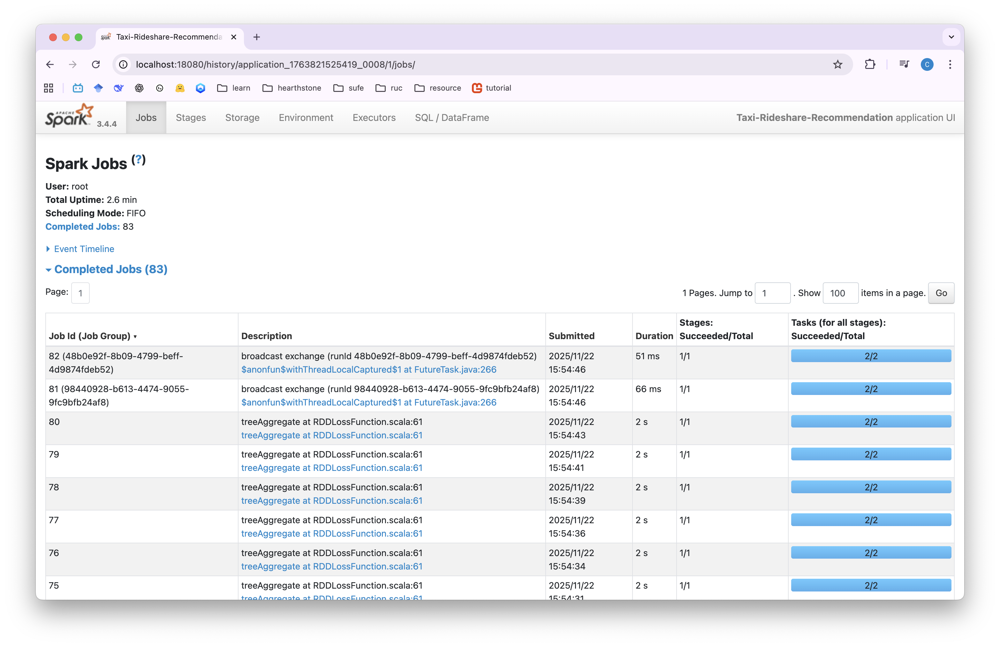
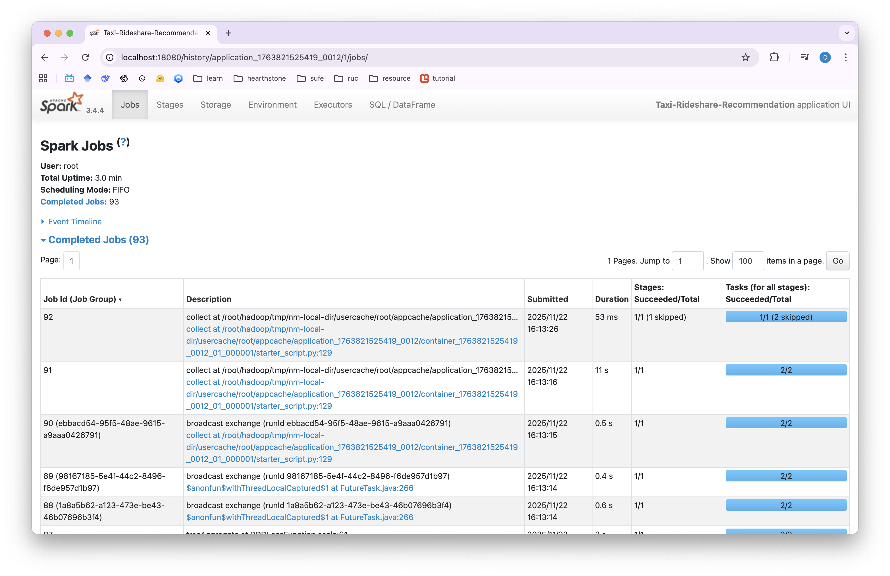
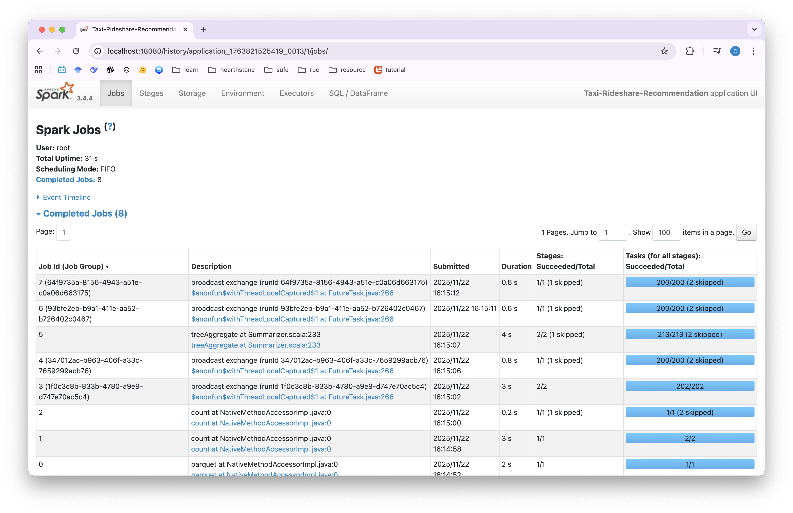

# Lab2

小组成员:

-   王晨瑞, 2025104213

-   余锐琦, 2025104231

## 环境配置

### 申请节点

首先选择 `Python 3.12` 环境，并申请一个节点。



### 制作lab2镜像


#### 初始化

进入镜像后，首先执行初始化程序。

```bash
bash /course487/software/init.sh

source /etc/profile

bash /course487/software/init_spark.sh
```

#### python 依赖

然后安装 `pyarrow` 包:

```bash
pip install pyarrow
```

#### spark 配置

调整 `spark-defaults.conf`:

```conf
# $SPARK_HOME/conf/spark-defaults.conf
spark.eventLog.enabled true
spark.eventLog.dir hdfs:///spark-logs        # 作业提交时使用的 event log 目录
spark.history.fs.logDirectory hdfs:///spark-logs
```

使用命令行将其写入配置文件:

```bash
cat > $SPARK_HOME/conf/spark-defaults.conf <<EOF
spark.eventLog.enabled           true
spark.eventLog.dir               hdfs:///spark-logs
spark.history.fs.logDirectory    hdfs:///spark-logs
EOF
```

#### 项目仓库

下载 `lab2` 仓库:

```bash
git clone https://github.com/Aoblex/25f-dc-lab2 ~/github/lab2
```

然后下载数据:

```bash
make download-dataset
```

#### 操作汇总

```bash
# initialization
bash /course487/software/init.sh
source /etc/profile
bash /course487/software/init_spark.sh

# python dependencies
pip install pyarrow

# spark configuration
cat > $SPARK_HOME/conf/spark-defaults.conf <<EOF
spark.eventLog.enabled           true
spark.eventLog.dir               hdfs:///spark-logs
spark.history.fs.logDirectory    hdfs:///spark-logs
EOF

# git repository download and data download
git clone https://github.com/Aoblex/25f-dc-lab2 ~/github/lab2
cd ~/github/lab2/ && make download-dataset

```

#### 保存

操作完成之后将镜像保存到个人环境中:



### 配置集群

使用刚才制作好的镜像申请三个节点，然后将其添加到集群中，并设置 `master node`。



设置主节点的 `/etc/hosts/`:

```
127.0.0.1       localhost
::1     localhost ip6-localhost ip6-loopback
fe00::0 ip6-localnet
ff00::0 ip6-mcastprefix
ff02::1 ip6-allnodes
ff02::2 ip6-allrouters
172.17.0.3      P4gn2j

192.168.1.30 P4gn2j
192.168.1.31 wJvpz0
192.168.1.32 qj76ar

192.168.1.30 node1
192.168.1.31 node2
192.168.1.32 node3
```

修改 `~/.ssh/config` 文件，把第一行注释掉:

```
# Host 192.168.1.*
IdentityFile /root/.ssh/id_rsa_6ea19af88bcc
```

然后将 `/etc/hosts` 复制到另外两个节点:

```bash
scp /etc/hosts node2:/etc/hosts
scp /etc/hosts node3:/etc/hosts
```

接下来可以初始化 hadoop 并添加 spark log 目录:

```bash
hdfs namenode -format
hdfs dfs -mkdir /sprak-logs
```

然后启动所有节点:

```bash
start-all.sh
```

并启动 `jobhistory server`:

```bash
$SPARK_HOME/sbin/start-history-server.sh
```

汇总(ssh配置好后可运行):

```bash
scp /etc/hosts node2:/etc/hosts
scp /etc/hosts node3:/etc/hosts

# spark configuration
cat > $SPARK_HOME/conf/spark-defaults.conf <<EOF
spark.eventLog.enabled           true
spark.eventLog.dir               hdfs:///spark-logs
spark.history.fs.logDirectory    hdfs:///spark-logs
EOF

hdfs namenode -format
hdfs dfs -mkdir /spark-logs

start-all.sh
$SPARK_HOME/sbin/start-history-server.sh
```

另外，在本地使用web ui查看job history:

```bash
ssh -N -L 18080:localhost:18080 -p 28521 root@hz-4.matpool.com
```

然后就可以在[本地查看](http://localhost:18080)任务记录。

## 实验运行

进入实验文件夹:

```bash
cd ~/github/lab2
```

运行测试任务:

```bash
make test
```

然后可以[查看](http://localhost:18080)刚才执行完成的任务:



下面通过三个方面对程序进行优化:

    1.  编程范式

    2.  通信机制

    3.  资源配置

### 编程范式

使用内置函数替代 UDF:

```python
def feature_engineering(df):
    df_feat = (
        df
        .withColumn("pickup_ts", F.to_timestamp("pickup_datetime"))
        .withColumn("pickup_hour", F.hour(F.col("pickup_ts")).cast("int"))
        .withColumn("pickup_grid_x", F.floor(F.col("pickup_longitude") * 100).cast("int"))
        .withColumn("pickup_grid_y", F.floor(F.col("pickup_latitude") * 100).cast("int"))
        .withColumn("pickup_zone", F.concat_ws("_", F.col("pickup_grid_x"), F.col("pickup_grid_y")))
        .withColumn(
            "distance_bucket",
            F.when(F.col("trip_distance").isNull(), F.lit("unknown"))
             .when(F.col("trip_distance") < 2.0, F.lit("short"))
             .when(F.col("trip_distance") < 8.0, F.lit("medium"))
             .otherwise(F.lit("long"))
        )
        .withColumn("pickup_date", F.to_date("pickup_ts"))
    )
    df_feat.persist()  # 缓存
    return df_feat
```

```python
def build_candidates(df_feat):
    df_small = (
        df_feat
        .select(
            "pickup_date", "pickup_hour", "pickup_zone",
            "pickup_latitude", "pickup_longitude",
            "trip_distance", "passenger_count", "pickup_datetime"
        )
    )

    a = df_small.alias("a")
    b = df_small.alias("b")

    join_cond = (
        (F.col("a.pickup_date") == F.col("b.pickup_date")) &
        (F.col("a.pickup_hour") == F.col("b.pickup_hour"))
        # 注意：此步仅编程范式优化，zone 还不加入
        &
        (F.col("a.pickup_datetime") < F.col("b.pickup_datetime"))
    )

    candidates = a.join(b, on=join_cond, how="inner")

    dx = F.col("a.pickup_latitude") - F.col("b.pickup_latitude")
    dy = F.col("a.pickup_longitude") - F.col("b.pickup_longitude")
    candidates = candidates.withColumn("pickup_distance", F.sqrt(F.pow(dx, 2) + F.pow(dy, 2)))

    return candidates
```

```python
def train_model(candidates):
    train_df = (
        candidates
        .withColumn("label", (F.col("pickup_distance") < 0.02).cast("int"))
        .select(
            "label",
            F.col("a.passenger_count").alias("passenger_a"),
            F.col("b.passenger_count").alias("passenger_b"),
            F.col("a.trip_distance").alias("trip_a"),
            F.col("b.trip_distance").alias("trip_b"),
            "pickup_distance"
        )
    )

    assembler = VectorAssembler(
        inputCols=["passenger_a", "passenger_b", "trip_a", "trip_b", "pickup_distance"],
        outputCol="features"
    )
    train_vec = assembler.transform(train_df).select("features", "label")
    lr = LogisticRegression(featuresCol="features", labelCol="label")
    model = lr.fit(train_vec)
    return model
```

### 优化通信

- 限制 Join 范围（加 zone）

- 按 key repartition，减少 shuffle

- 避免全表笛卡尔配对

```python
def build_candidates(df_feat):
    df_small = (
        df_feat
        .select(
            "pickup_date", "pickup_hour", "pickup_zone",
            "pickup_latitude", "pickup_longitude",
            "trip_distance", "passenger_count", "pickup_datetime"
        )
    )

    # 按 join key 重新分区，减少 shuffle
    repart_keys = ["pickup_date", "pickup_hour", "pickup_zone"]
    df_small = df_small.repartition(*repart_keys).persist()

    a = df_small.alias("a")
    b = df_small.alias("b")

    join_cond = (
        (F.col("a.pickup_date") == F.col("b.pickup_date")) &
        (F.col("a.pickup_hour") == F.col("b.pickup_hour")) &
        (F.col("a.pickup_zone") == F.col("b.pickup_zone")) &
        (F.col("a.pickup_datetime") < F.col("b.pickup_datetime"))
    )

    candidates = a.join(b, on=join_cond, how="inner")

    dx = F.col("a.pickup_latitude") - F.col("b.pickup_latitude")
    dy = F.col("a.pickup_longitude") - F.col("b.pickup_longitude")
    candidates = candidates.withColumn("pickup_distance", F.sqrt(F.pow(dx, 2) + F.pow(dy, 2)))

    return candidates

```

### 资源配置

- 控制 shuffle 阶段的分区数量

- 设置 RDD 默认并行度

- 开启自适应查询执行（Adaptive Query Execution, AQE）

- 在 AQE 下启用小分区合并

- 启用 skew join 自动优化

```Makefile
optimized-test: dataset
	hdfs dfs -mkdir -p /spark-logs
	spark-submit \
	--master yarn \
	--deploy-mode cluster \
	--conf spark.sql.adaptive.enabled=true \
	--conf spark.sql.adaptive.coalescePartitions.enabled=true \
	--conf spark.sql.adaptive.skewJoin.enabled=true \
	--conf spark.sql.shuffle.partitions=200 \
	--conf spark.default.parallelism=24 \
	--conf spark.eventLog.enabled=true \
	--conf spark.eventLog.dir=hdfs:///spark-logs \
	--name Taxi-Rideshare-Recommendation-Optimized \
	scripts/optimized.py --taxi_path hdfs:///input/nyc_taxi/sample
```

## 实验结果

在上一节的实验中，所有数据均为原始数据中采样的20000行，用于探究性能问题。

下面是各个实验耗时的结果:

| 优化方式 | 总耗时 |
| --- | --- |
| 无 | 3.0 min|
| 编程范式 | 2.6 min |
| 通信机制 | 39 s |
| 资源配置 | 3.0 min |
| 全部 | 31 s |








